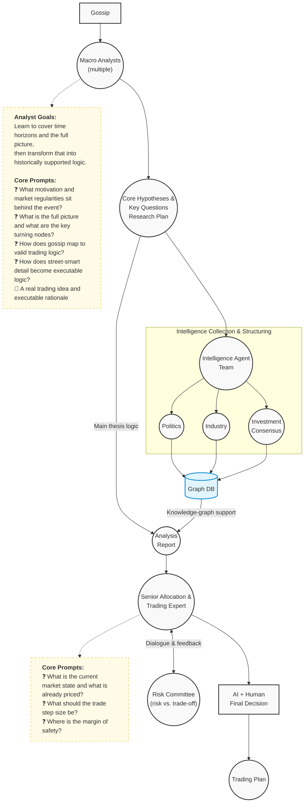

# Agentic Trading Workflow

An early open-source implementation of an agentic investment-research pipeline.

This project turns a rough market idea (gossip, intuition, or a hypothesis) into:

1. A professionally framed research question.
2. A testable strategy thesis.
3. A structured risk-and-trade decision process.
4. A final investment plan with human-in-the-loop governance.

## Why This Project Exists

Most strategy ideas fail not because they are always wrong, but because they are under-defined. This project is designed to solve that by enforcing a disciplined workflow:

- Convert vague narratives into explicit assumptions.
- Break assumptions into verifiable questions.
- Gather structured intelligence.
- Synthesize analysis into trade logic.
- Stress-test through risk committee feedback.
- Produce an actionable trading plan.

## Full Workflow (Current Design)



## Workflow Interpretation

### 1) Gossip to Macro Framing

- Input can be noisy (rumor, headline, anecdotal flow).
- Macro analysts convert noise into structured context, focusing on motive, mechanism, and timeline.
- Output is not a trade yet; it is a disciplined problem statement.

### 2) Hypotheses and Research Plan

- The strategy analyst turns the problem statement into testable assumptions.
- Assumptions are linked to key questions and validation nodes.
- This creates a falsifiable plan, avoiding narrative-only conviction.

### 3) Intelligence Team and Graph DB

- Intelligence collection is split by domain:
  - Politics (policy, government behavior, geopolitical constraints)
  - Industry (supply chain, production, demand, bottlenecks)
  - Investment Consensus (positioning, valuation, market expectations)
- Findings are structured into a graph database to preserve relationships between actors, events, and impacts.

### 4) Analysis Report Synthesis

- Main thesis logic from the research plan is combined with graph-backed evidence.
- The report should explicitly map each conclusion to assumptions and evidence.

### 5) Trade Expert and Risk Committee Loop

- Senior trading expertise translates analysis into executable positioning.
- Risk committee pressure-tests assumptions, sizing, and downside paths.
- The two-way loop is intentional: execution quality is as important as idea quality.

### 6) Final Human + AI Decision

- Final output is a trade plan, not just an opinion.
- Human oversight remains mandatory for accountability and judgment.

## Existing Skills (Current Repo)

### 1) `Analyst-Strategy`

Purpose:

- Convert rough user ideas into professional, investment-grade strategy questions.
- Force objective validation and avoid overconfident narrative jumps.

What it does well now:

- Provides a clear analytical framework:
  - Motivation and market regularities
  - Full picture and key nodes
  - Gossip-to-trading-logic conversion
  - Street-smart-to-execution transformation
- Defines operational flow for two states:
  - Initialization stage (create research workspace and start primary analysis)
  - Post-intelligence stage (combine intelligence and write investment-facing report)

Core output artifacts:

- Initial analysis markdown.
- Structured research plan JSON.
- Report-writing task decomposition JSON.

### 2) `Observer-Politics` (GovObserver)

Purpose:

- Collect objective government and policy intelligence for a given topic.
- Build stakeholder structure first, then run directed intelligence collection.

What it does well now:

- Enforces a two-stage procedure:
  - Stage 1: Stakeholder graph construction (Kuzu graph schema + relation modeling).
  - Stage 2: Directed intelligence collection only after user confirmation.
- Emphasizes source quality, neutrality, and traceability.
- Produces structured outputs suitable for upstream strategy analysts.

Why this matters:

- Policy and geopolitical drivers are often the earliest source of pricing regime shifts.
- Separating objective observation from strategy interpretation improves signal quality.

## Project Status (As of 2026-03-24)

### What is completed

- Core project vision and workflow concept are defined.
- Skill foundation is implemented with at least two active skills:
  - `Analyst-Strategy`
  - `Observer-Politics`
- One end-to-end research case directory has been initialized:
  - `202603230253_MidEast_Energy`
- For this case, the following intermediate outputs are complete:
  - `intermediate/primary_analysis.md`
  - `intermediate/research_plan.json`
  - `intermediate/report_writing_task.json`
- Global research registry is in place:
  - `GLOBAL_RECORD.md`

### Where the case currently stands

Current case topic:

- Potential impact of Hormuz Strait blockade risk and energy crisis on China new-energy sectors.

Current progress state:

- Research planning is complete.
- Waiting for intelligence collection and evidence enrichment.
- Final report writing and risk-committee style synthesis are not completed yet.

### What is not completed yet

- Full intelligence collection pipeline execution for the case.
- Graph-DB-backed intelligence artifacts in repo outputs.
- Combined final analysis report in `output/`.
- Trade execution layer details (position construction, sizing, risk limits) in production-ready form.
- Backtesting or live validation integration.

## Repository Structure

```text
Agentic-Trading/
├── .claude/
│   └── skills/
│       ├── Analyst-Strategy/
│       │   ├── SKILL.md
│       │   └── references/
│       └── Observer-Politics/
│           ├── SKILL.md
│           └── references/
├── 202603230253_MidEast_Energy/
│   ├── intermediate/
│   │   ├── primary_analysis.md
│   │   ├── research_plan.json
│   │   └── report_writing_task.json
│   └── output/
├── GLOBAL_RECORD.md
└── CLAUDE.md
```

## Development Roadmap

Short term:

- Complete intelligence ingestion for the existing case.
- Materialize graph database artifacts and relation snapshots.
- Generate first complete final report in `output/`.

Mid term:

- Add domain observers for industry and consensus collection.
- Add standardized evaluation templates for hypothesis validation quality.
- Introduce reusable risk-committee checklist artifacts.

Long term:

- Integrate backtesting and scenario stress engine.
- Build repeatable portfolio construction module with explicit risk budgets.
- Add experiment tracking and strategy-performance provenance.

## Open-Source Readiness Note

This repository is already suitable for an early open-source release if positioned as:

- A workflow-first research framework.
- A skill-driven architecture in active build-out.
- A transparent, documented prototype with real intermediate artifacts.

Recommended framing:

- "Public alpha" or "research preview" rather than "production trading system".

---

## 中文版说明

### 项目定位

这是一个面向投资研究的 Agentic 工作流原型。项目目标是把用户的粗糙想法（传闻、直觉、待验证命题）系统化地转化为：

1. 专业化研究问题。
2. 可验证的策略假设。
3. 有风控约束的交易决策过程。
4. 最终可执行的投资方案。

### 项目要解决的问题

很多策略失败并非因为方向一定错误，而是因为定义不清、验证不足。本项目通过流程化约束来解决这一点：

- 把模糊叙事拆解为明确假设。
- 把假设拆成可验证问题。
- 收集结构化情报并沉淀关系。
- 将证据汇总为交易逻辑。
- 通过风控反馈做压力测试。
- 输出可执行的交易计划。

### 全貌工作流解读

1. Gossip 到宏观分析：先去噪，再建立动机、机制、时间线，不直接跳交易。
2. 假设与研究计划：形成可证伪框架，明确关键问题与验证节点。
3. 情报团队分工：政治、产业、投资共识三路并行，最后结构化入图谱数据库。
4. 报告汇总：主线逻辑结合图谱证据，确保结论可追溯。
5. 交易专家与风控小组闭环：讨论定价充分性、仓位步长、安全边际与取舍。
6. 人机协同终决：最终产出交易计划，而不只是观点。

### 当前已有 Skills

1. Analyst-Strategy
- 作用：把待验证命题转为专业研究问题，并强制执行客观验证。
- 能力：动机与规律、事件全貌与节点、传闻到交易逻辑、盘感到可执行逻辑。
- 当前产物：初步分析、研究计划、报告写作任务拆解。

2. Observer-Politics（GovObserver）
- 作用：围绕政府与政策维度进行客观情报搜集。
- 能力：先做利益相关方图谱，再做定向情报搜集，并要求用户确认阶段切换。
- 价值：提高政策与地缘信息信噪比，减少过度主观解读。

### 当前进度（截至 2026-03-24）

已完成：

- 项目主流程与研究框架定义。
- 两个核心 Skill 的初版落地（Analyst-Strategy、Observer-Politics）。
- 已创建并推进一个研究案例目录：202603230253_MidEast_Energy。
- 该案例中间文件已产出：
  - intermediate/primary_analysis.md
  - intermediate/research_plan.json
  - intermediate/report_writing_task.json
- 全局研究登记文件已建立：GLOBAL_RECORD.md。

进行到哪一步：

- 目前处于“研究计划已完成，待情报搜集与证据补全”的阶段。
- 最终综合分析报告与风控闭环输出尚未完成。

尚未完成：

- 当前案例的完整情报采集执行。
- 图谱数据库相关中间产物沉淀。
- output 目录下的最终报告。
- 更生产化的交易执行层（仓位、风控阈值、约束机制）。
- 回测或实盘验证模块接入。

### 开源阶段建议

当前仓库已经适合“抢先开源”，建议定位为：

- Public alpha / Research preview（公开测试版 / 研究预览版）。

不建议现阶段定位为“可直接生产交易系统”。
